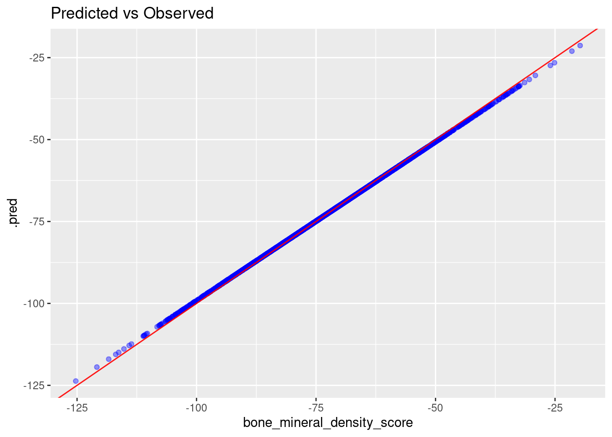
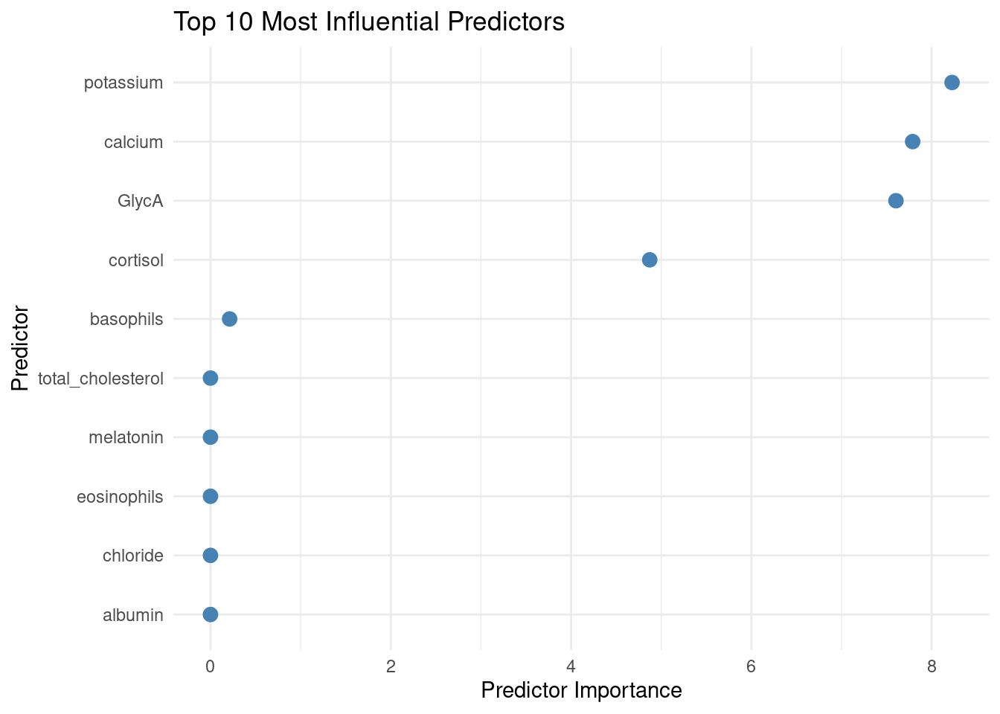
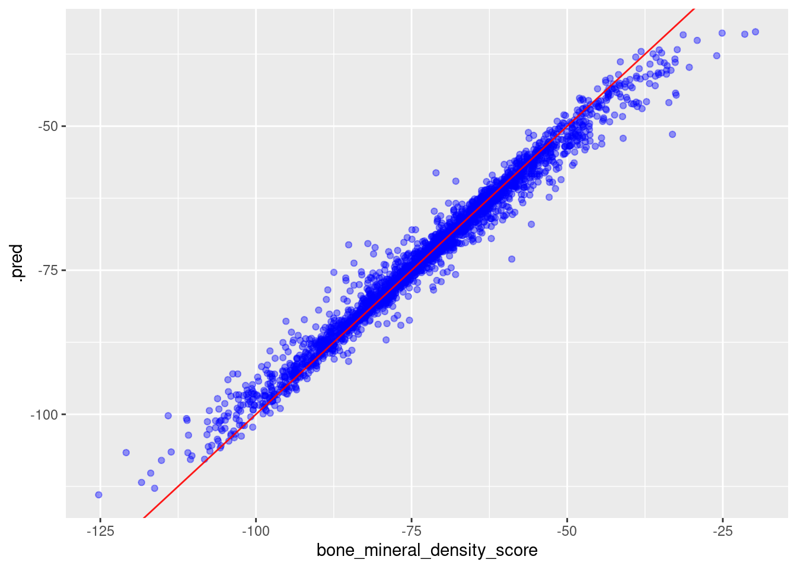
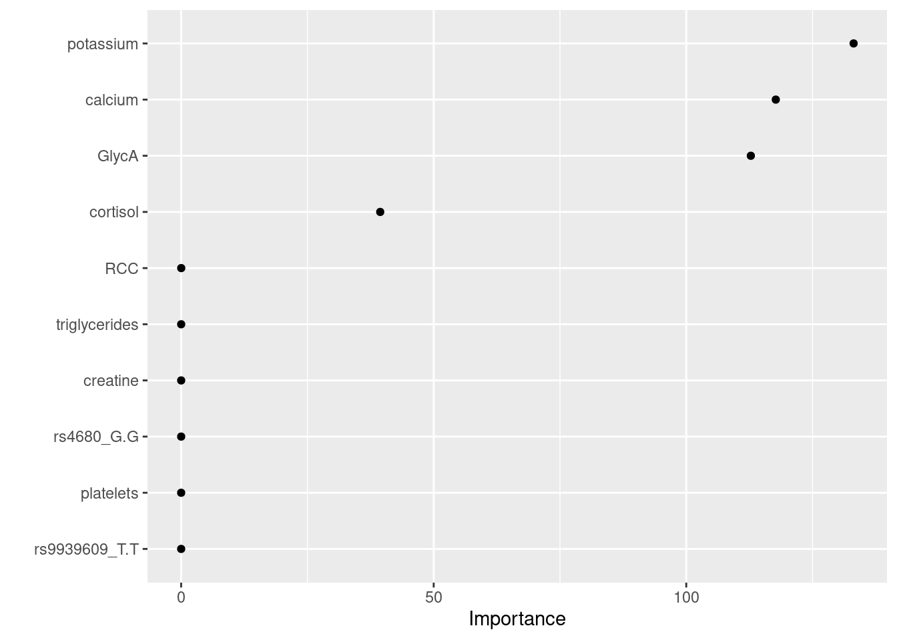

# Bone-Mineral-Density_Report
The Bone Mineral Density Study is a longitudinal investigation designed to identify risk factors associated with osteoporosis. 
The dataset includes information from 10,000 individuals. 
This project aims to analyze the data using appropriate statistical and computational methods to determine the key predictors influencing bone mineral density (BMD) and contributing to osteoporosis risk.

# Overview

This project explores predictive modeling of bone mineral density (BMD) score using a large tabular dataset (10,000 observations, 31 variables including biochemical markers, genetic variants (SNPs), and lifestyle factors). Three supervised regression models — Linear Regression (Elastic Net), Random Forest, and K-Nearest Neighbours (KNN) — are trained, tuned, and compared using the tidymodels framework in R to identify which predictors most strongly influence bone mineral density and which modeling approach best captures the relationship between predictors and outcome.

# Workflow:

1- Data import: using the **read_tsv()** function

2- Exploratory analysis: Full scatterplot matrix using the **ggpairs()** function.

3- Train/test split — 75/25 split with 5-fold cross-validation (vfold_cv) for hyperparameter tuning.

## Linear Regression
4- Linear regression model implementation: 

i- define the type of model

ii- set the engine of the model (computational backend of the model)

iii- Set the recipe of the model by defining the outcome variable (bone_mineral_density_score) and the training subset

iv- used the step_dummy() function to convert categorical predictors into numeric dummy variables, making them suitable for models like linear regression.

v- Applied step_normalize() to normalize all numeric predictor variables, for the purpose of ensuring all predictors have the same scale

vi- Created the workflow that includes the defined model and the recipe in a single object.

vii- performed hyperparameter tuning. I defined the grid of combinations of penalty and mixture values (3 values each) that will be tested during hyperparameter tuning to find the best model. Using cross-validation, I evaluated all parameter combinations to determine their effect on model performance, measured by RMSE and R². The best-performing model, selected based on the lowest RMSE, had penalty = 0 and mixture = 0.05, achieving an RMSE of 0.447 and an R² of 0.999998, indicating 
excellent predictive accuracy.

viii- Fitted the developed model with the best parameters on the training data

ix- Used the fitted model to perform predictions on the testing subset.
The following plot represents the predictions: 

x- Checked the prediction metrics, which reflect the performance of the model

metric    .estimator    .estimate
1 rmse    standard       0.459
2 rsq     standard       1.00 
3 mae     standard       0.367

The values obtained suggest that the model captures the relationship between the predictor(s) and the outcome very well, with minimal prediction error.

xi- Extracted the top 10 most important predictors that contribute to the outcome.
The dot plot reflecting the top 10 predictors:

## Random Forest

5- Random Forest model implementation

i- define the type of model

ii- Set the engine of the model (computational backend of the model)

iii- Set the recipe of the model by defining the outcome variable (bone_mineral_density_score) and the training subset. 

iv- Used the step_dummy() function to convert categorical predictors into numeric dummy variables, making them suitable for models like linear regression.

v- Created the workflow that includes the defined model and the recipe in a single object.

vi- *Defined a tuning grid:
* Defined a tuning grid for the Random Forest hyperparameters, then performed hyperparameter tuning to evaluate different parameter combinations and selected the best-performing parameters based on RMSE value.
* The best-performing model had RMSE = 2.78and R² = 0.98 on the training data. Number of trees equal 432

vii- *Fitted the best model on the training subset and performed prediction on the testing subset.

The plot reflecting the prediction:

ix- Calculated the prediction metrics:
*.metric .estimator .estimate

*1 rmse    standard       2.63 
*2 rsq     standard       0.975
*3 mae     standard       1.74 

The values obtained suggest that the model captures the relationship between the predictor(s) and the outcome very well, with minimal prediction error.

x- The predictors that have the most importance in terms of contributing to the outcome.

7- The importance plot obtained is equivalent to the one obtained in the linear regression. Potassium is the most important predictor.
I generated a scatter plot and performed Pearson correlation to study the correlation between potassium and the Bone Mineral Density Score.

